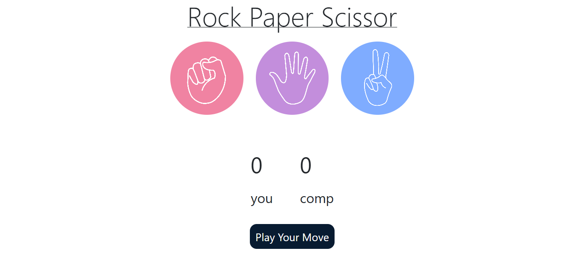

# 🕹️ Rock Paper Scissors Game

This is a simple and interactive **Rock Paper Scissors** game built using **HTML**, **CSS**, and **JavaScript**. It allows the user to play against the computer in a clean, responsive UI with live score tracking and color-coded win/loss feedback.

---

## 📸 Preview

---

## 🚀 Live Demo

🔗 [Click here to play](https://kaustubh-dalvi1001.github.io/Rock-Paper-Scissors-Game-JS/)  

---

## 🎮 Features

- Rock, Paper, Scissors game logic
- Scoreboard with live updates
- Visual feedback for win, lose, and draw
- Responsive design
- Hover animations and clean UI

---

## 🛠️ Technologies Used

- HTML5  
- CSS3  
- JavaScript (Vanilla)  
- Bootstrap 5 (CDN)

---

## 🧑‍💻 Author

**Kaustubh Dalvi**  
🔗 [GitHub](https://github.com/Kaustubh-Dalvi1001)

---

## 📜 License

This project is open-source and free to use.
